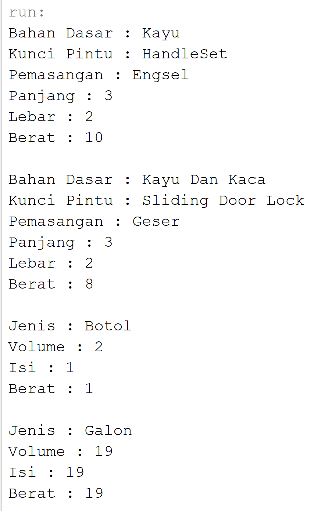
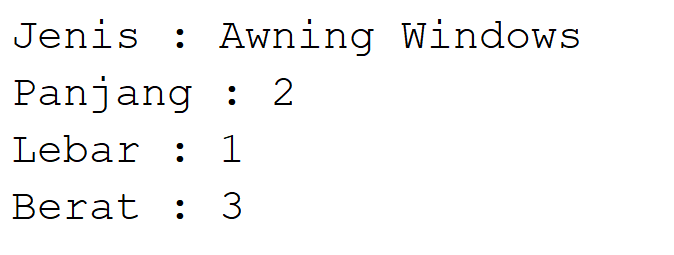
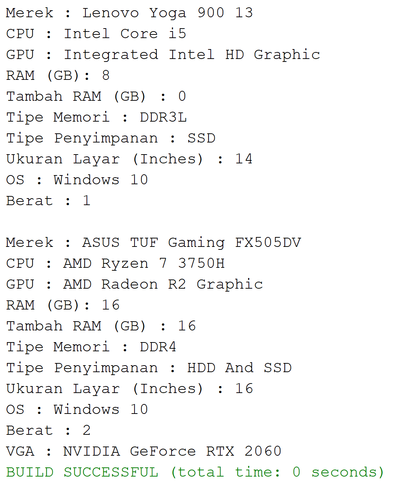
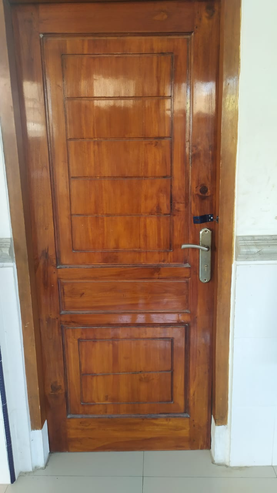
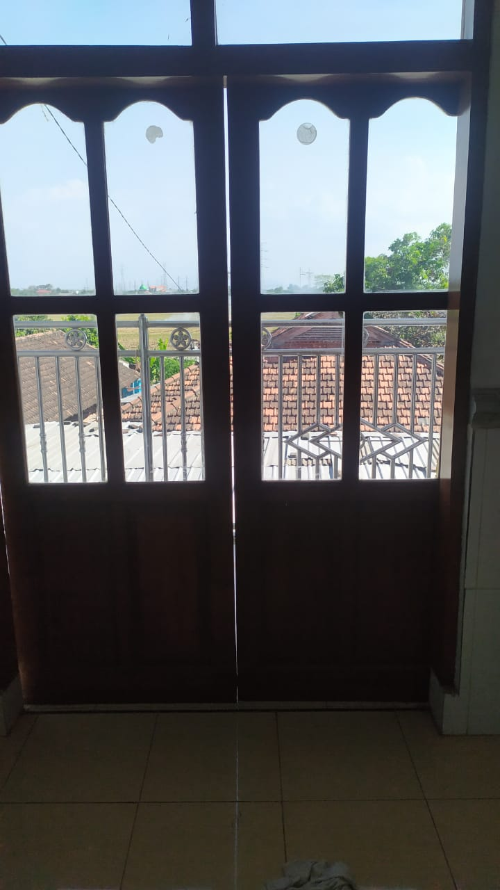
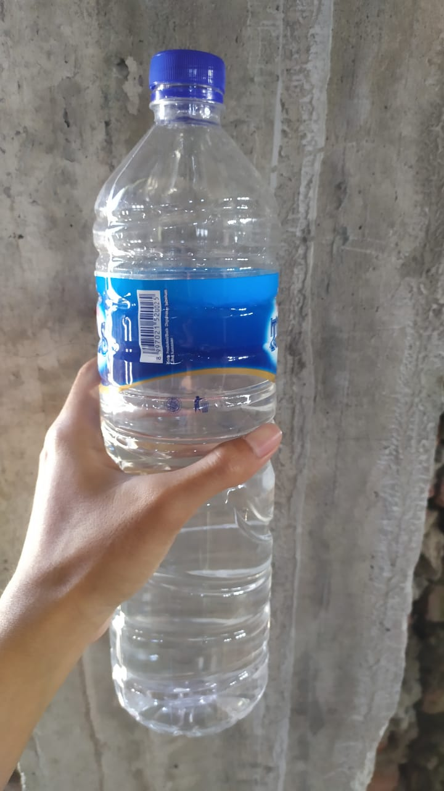
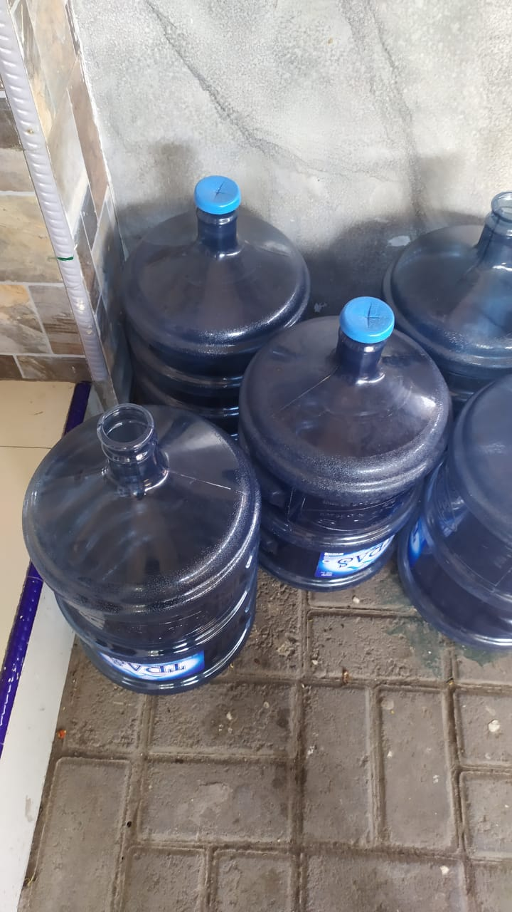
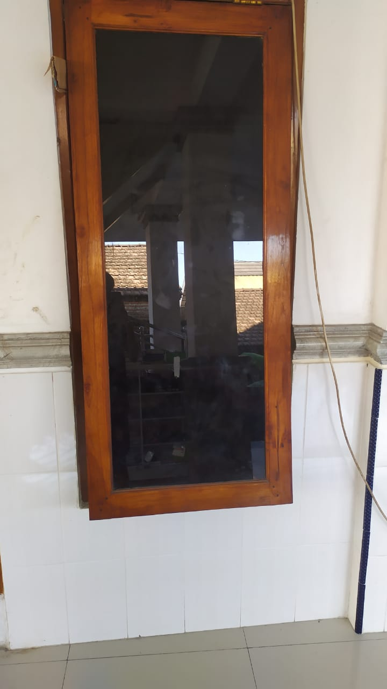
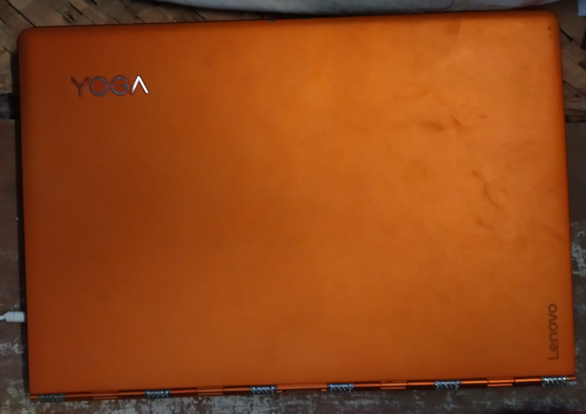
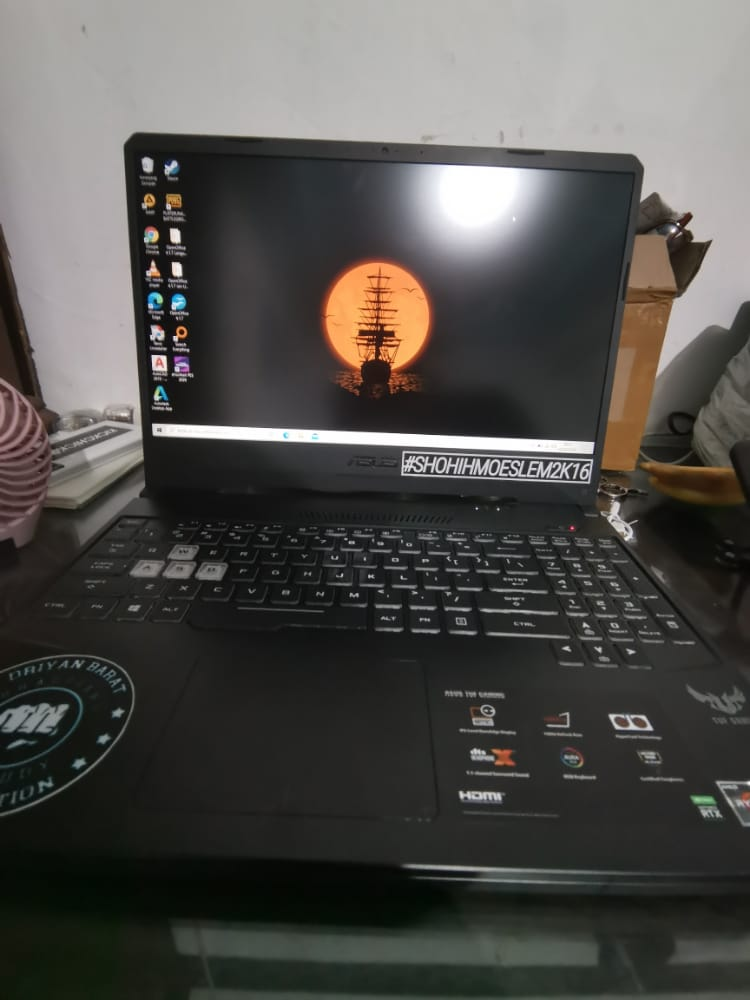

# Laporan Praktikum Pertemuan 1

## Output Program

## Image Objek

Hasil Dari Identifikasi Objek Yang Ada Disekitar Saya. Objek Yang Dimaksud Yaitu :

1. Pintu
2. Wadah Air
3. Jendela
4. Laptop

Penjelasan Program : 

Menurut Dari Hasil Objek Yang DiIdentifikasi Di Dunia Nyata Maka DiBuat Program Untuk Menuliskan State Dan Behaviour Objek Ke Komputer.
