## Laporan Pertemuan 11

# Percobaan 1

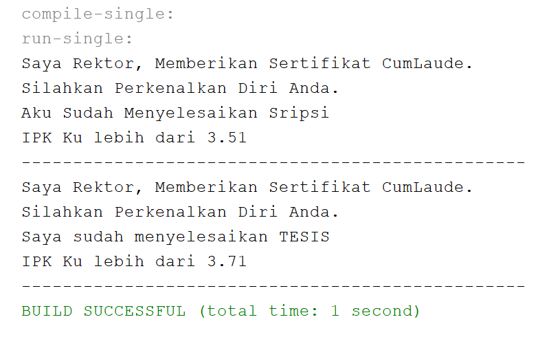

# Pertanyaan Percobaan 1

1.  Pada langkah ke 9, pada baris program ke 3 terdapat warning pada script tersebut. Jelaskan penyebab terjadinya hal tersebut ?
    Karena sudah berada dalam satu package jadi tidak perlu di import.
    
2.  Pada langkah ke 9, pada baris program ke 3. Apa yang terjadi jika script tersebut dihilangkan? Jelaskan menurut pemahaman anda.
    Tidak terjadi error karena sudah satu package dan tidak perlu di import.
3.  Mengapa pada langkah nomor 9 terjadi error? Jelaskan!
    Karena pada class Mahasiswa tidak mengimplements Interface ICumLaude.
    
4.  Dapatkah method kuliahDiKampus() dipanggil dari objek sarjanaCumlaude di class Program? Mengapa demikian?
    Bisa karena Class Sarjana mengextends Class Mahasiswa yang mempunyai method kuliahDiKampus().
    
5.  Dapatkah method kuliahDiKampus() dipanggil dari parameter mahasiswa di method beriSertifikatCumlaude() pada class Rektor? Mengapa demikian?
    Bisa. Jika kita menambahkan method kuliahDiKampus() pada Interface ICumLaude.
    
6. Modifikasilah method beriSertifikatCumlaude() pada class Rektor agar hasil eksekusi class Program menjadi seperti berikut ini:

  Menambahkan Method kuliahDiKampus() di Class Sarjana dan Class PascaSarjana / pada Interface
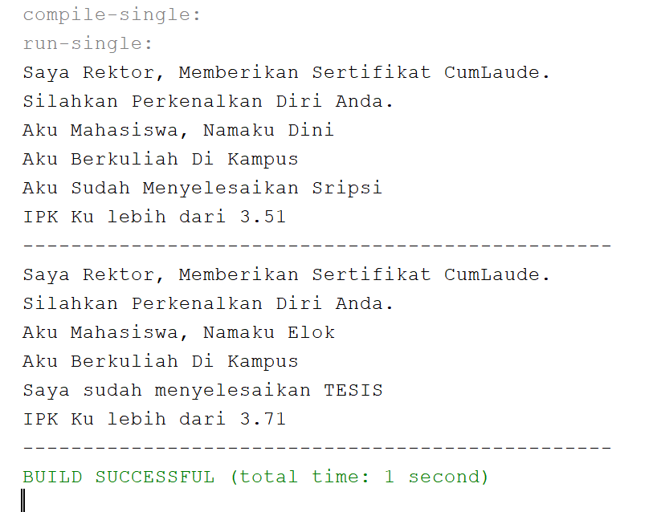

# Percobaan 2

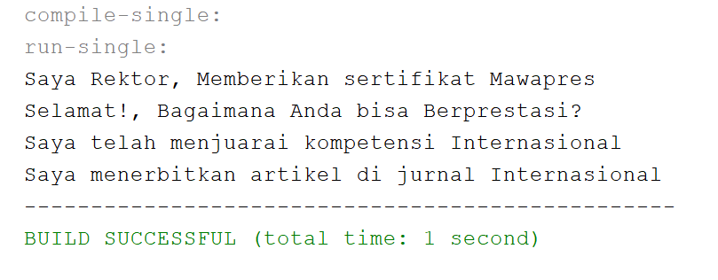

1.  Pada script code interface IBerprestasi, modifikasi script tersebut sesuai dengan gambar dibawah ini :

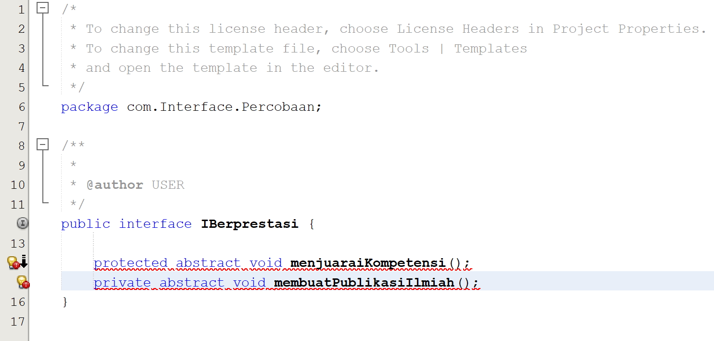

    Akan terjadi error karena semua method yang ada di Class Interface harus bertype Public.
    
2.  Jelaskan menurut anda, mengapa hasil dari script code tersebut error ?
    Karena pada Interface tidak bisa menginstansiasi Objek.
    
3.  Apabila Sarjana Berprestasi harus menjuarai kompetisi NASIONAL dan menerbitkan artikel di jurnal NASIONAL, 
    maka modifikasilah class-class yang terkait pada aplikasi Anda agar di class Program objek pakRektor dapat 
    memberikan sertifikat mawapres pada objek sarjanaCumlaude.
    
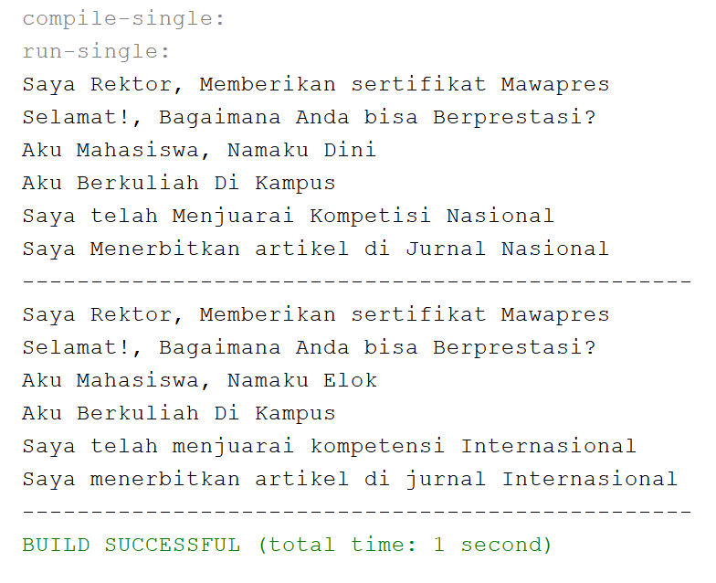

# Tugas

# Class Binatang

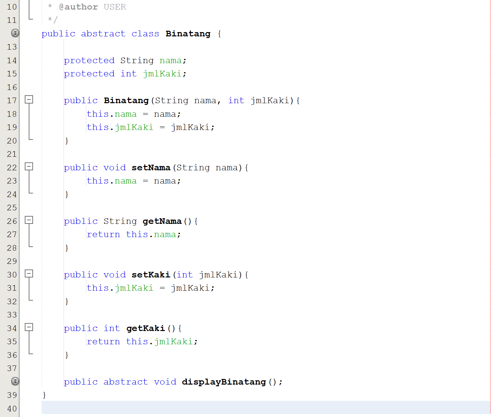

Class ini menggunakan Abstract yang akan mewariskan nama dan jmlKaki ke subclass yang membutuhkan setter dan getter untuk memperoleh nama dan jmlKaki.

# Class IKarnivora

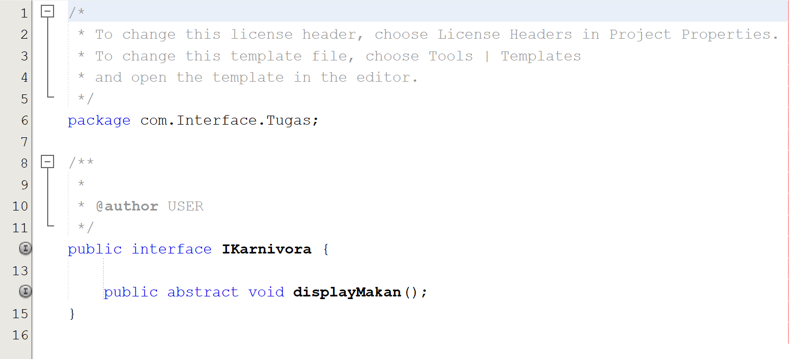

Interface untuk menampilkan makanan hewan karnivora.

# Class IHerbivora

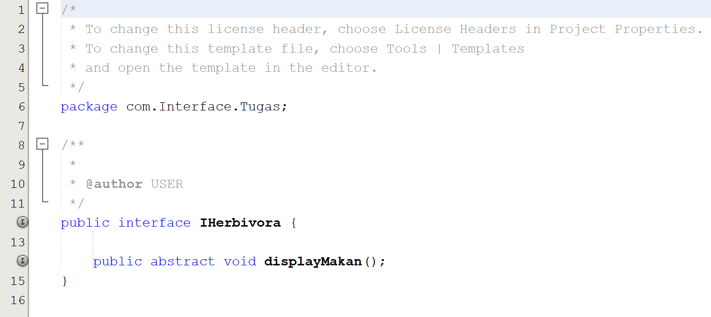

Interface untuk menampilkan makanan hewan herbivora.

# Class Keledai

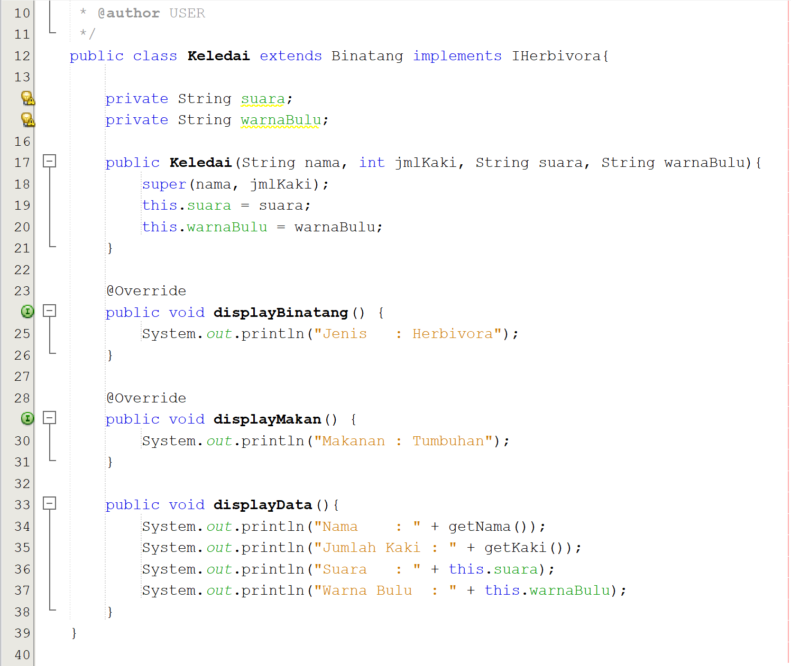

Class Keledai terdapat konstruktor untuk memperoleh atribut nama dan jmlkaki yang berasal dari class abstract binatang dan atribut 2 tambahan
Class ini di implementasikan ke herbivora karena keledai adalah hewan herbivora. ada method displayMakan() untuk mengetahui makanan hewan herbivora.
Method displayBinatang() untuk mengetahui jenis binatang herbivora dan Method displayData Untuk mengetahui data binatang yang di peroleh dari
Class Abstract Binatang.

# Class Singa

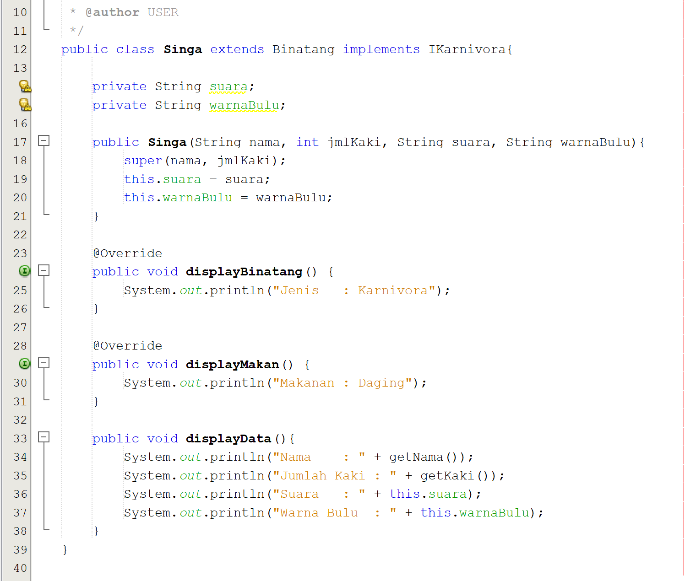

Class Singa terdapat konstruktor untuk memperoleh atribut nama dan jmlkaki yang berasal dari class abstract binatang dan atribut 2 tambahan
Class ini di implementasikan ke karnivora karena singa adalah hewan karnivora. ada method displayMakan() untuk mengetahui makanan hewan karnivora.
Method displayBinatang() untuk mengetahui jenis binatang karnivora dan Method displayData Untuk mengetahui data binatang yang di peroleh dari
Class Abstract Binatang.

# Class Gorilla

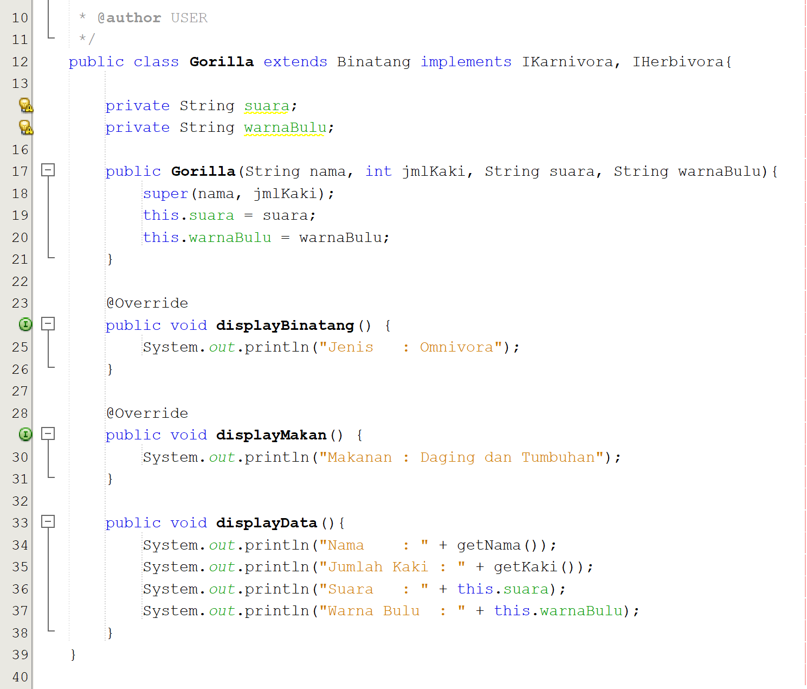

Class Gorilla terdapat konstruktor untuk memperoleh atribut nama dan jmlkaki yang berasal dari class abstract binatang dan atribut 2 tambahan
Class ini di implementasikan ke karnivora dan herbivora karena Gorilla adalah hewan omnivora. ada method displayMakan() untuk mengetahui makanan hewan omnivora.
Method displayBinatang() untuk mengetahui jenis binatang omnivora dan Method displayData Untuk mengetahui data binatang yang di peroleh dari
Class Abstract Binatang.

# Class Main

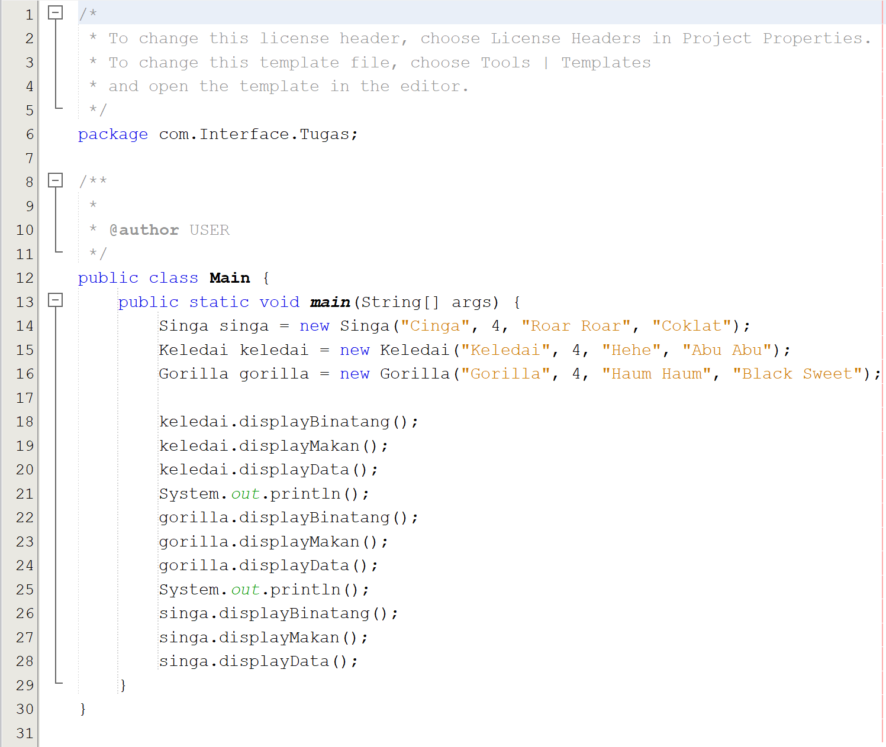

# Class Diagram

    
