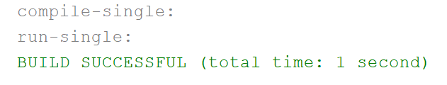
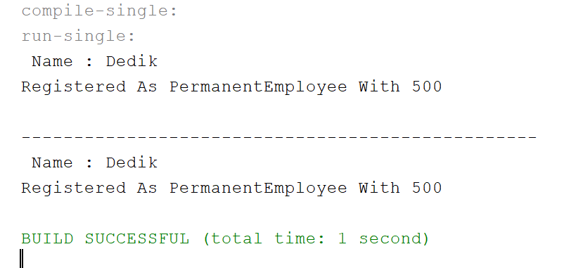
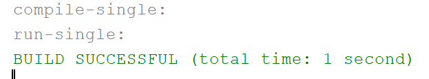
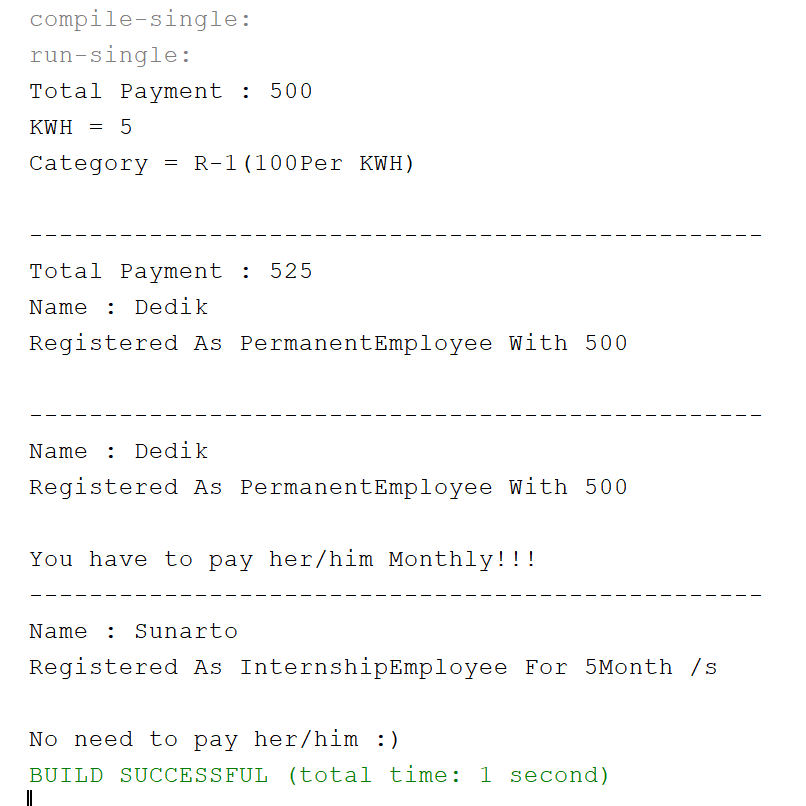
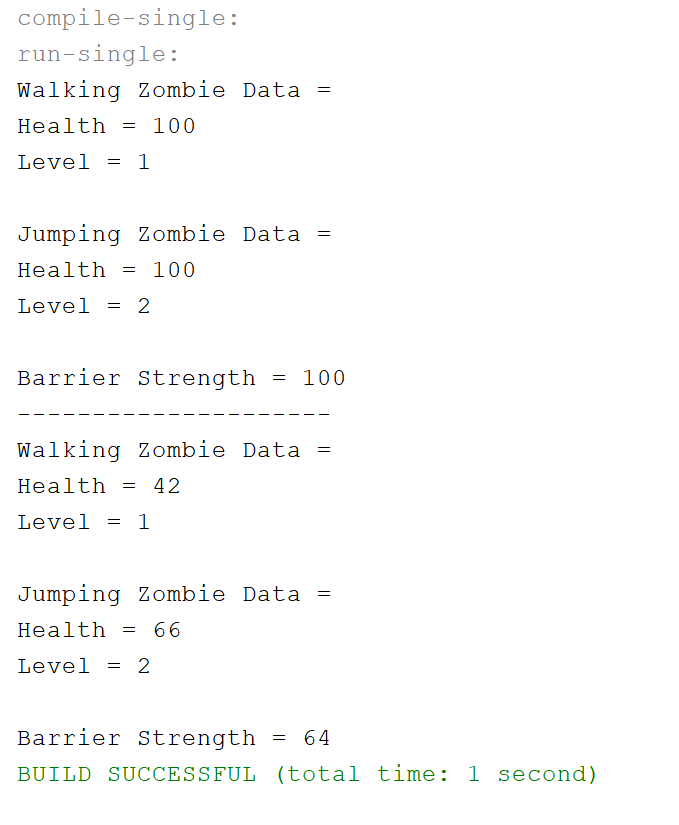

## Laporan Pertemuan 12

# Percobaan 1

4.2 Pertanyaan

1.  Class apa sajakah yang merupakan turunan dari class Employee?

    Class PermanentEmployee() Dan Class InternshipEmployee()
    
2.  Class apa sajakah yang implements ke interface Payable?

    Class PermanentEmployee() Dan Class ElectricityBill()
    
3.  Perhatikan class Tester1, baris ke-10 dan 11. Mengapa e, bisa diisi dengan objek pEmp (merupakan objek dari class PermanentEmployee)
    dan objek iEmp (merupakan objek dari class InternshipEmploye) ?
    
    Karena Class Employee() As e Merupakan Parent Class
    
4.  Perhatikan class Tester1, baris ke-12 dan 13. Mengapa p, bisa diisi dengan objek pEmp (merupakan objek dari class PermanentEmployee) 
    dan objek eBill (merupakan objek dari class ElectricityBill) ?
    
    Karena Class PermanentEmployee() Dan Class ElectricityBill() Mengimplements Interface Payable() As p
    
5.  Coba tambahkan sintaks:
    p = iEmp;
    e = eBill;
    pada baris 14 dan 15 (baris terakhir dalam method main)! Apa yang menyebabkan error?
    
    Karena Class Internship() Tidak Mengimplements Interface Payable() Dan Class ElectricityBill() Bukan SubClass Dari Class Employee()
    
6.  Ambil kesimpulan tentang konsep/bentuk dasar polimorfisme!

    Polimorfisme Merupakan Object Yang Memiliki Banyak Bentuk Sesuai Bentuk Object Yang Ingin Diinstansiasi Yang Memiliki Relasi Inheritance
    Dan Interface
    
# Percobaan 2

5.2 Pertanyaan

1.  Perhatikan class Tester2 di atas, mengapa pemanggilan e.getEmployeeInfo() pada baris 8 dan pEmp.getEmployeeInfo() pada baris 10 
    menghasilkan hasil sama?
    
    Karena Terjadi Polimorfisme Class Employee() Pada Class PermanentEmployee() Dan Deklarasi Dari Object Class PermanentEmployee()
    Maka Menghasilkan Output Yang Sama
    
2.  Mengapa pemanggilan method e.getEmployeeInfo() disebut sebagai pemanggilan method virtual (virtual method invication), sedangkan
    pEmp.getEmployeeInfo() tidak?
    
    Karena Ada Pemanggilan Method Overriding Dari Suatu Object Polimorfisme Sedangkan pEmp.getEmployeeInfo() Merupakan Pemanggilan Method
    Dari Object Class Itu Sendiri.
    
3.  Jadi apakah yang dimaksud dari virtual method invocation? Mengapa disebut virtual?

    Virtual method invocation terjadi ketika ada pemanggilan overriding method dari suatu objek polimorfisme. Disebut virtual karena antara 
    method yang dikenali oleh compiler dan method yang dijalankan oleh JVM berbeda.
    
# Percobaan 3

6.2 Pertanyaan

1.  Perhatikan array e pada baris ke-8, mengapa ia bisa diisi dengan objek objek dengan tipe yang berbeda, yaitu objek pEmp (objek dari
    PermanentEmployee) dan objek iEmp (objek dari InternshipEmployee) ?
    
    Karena Object pEmp Dan iEmp Merupakan Subclass Dari Class Employee()
    
2.  Perhatikan juga baris ke-9, mengapa array p juga biisi dengan objek-objek dengan tipe yang berbeda, yaitu objek pEmp (objek dari
    PermanentEmployee) dan objek eBill (objek dari ElectricityBilling) ?
    
    Karena Object pEmp Dan eBill MengImplements Interface Payable
    
3.  Perhatikan baris ke-10, mengapa terjadi error?

    Karena Object eBill Tidak Memiliki Relasi Inheritance Dengan Class Employee()
    
# Percobaan 4

1.  Perhatikan class Tester4 baris ke-7 dan baris ke-11, mengapa pemanggilan ow.pay(eBill) dan ow.pay(pEmp) bisa dilakukan, padahal jika 
    diperhatikan method pay() yang ada di dalam class Owner memiliki argument/parameter bertipe Payable? Jika diperhatikan lebih detil 
    eBill merupakan objek dari ElectricityBill dan pEmp merupakan objek dari PermanentEmployee?
    
    Karena Class Dari Object eBill Dan pEmp MengImplements Interface Payable()
    
2.  Jadi apakah tujuan membuat argument bertipe Payable pada method pay() yang ada di dalam class Owner?
    
    Untuk Mendeklarasikan Class Class Yang Mengimplements Interface Payable()
    
3.  Coba pada baris terakhir method main() yang ada di dalam class Tester4 ditambahkan perintah ow.pay(iEmp); Mengapa terjadi error?

    Karena Class Dari Object iEmp Tidak MengImplements Interface Payable()
    
4.  Perhatikan class Owner, diperlukan untuk apakah sintaks p instanceof ElectricityBill pada baris ke-6 ?

    Untuk Mengecheck Apakah ElectricityBill Merupakan Hasil Instansiasi Dari Sintax p
    
5.  Perhatikan kembali class Owner baris ke-7, untuk apakah casting objek disana (ElectricityBill eb = (ElectricityBill) p) diperlukan ? 
    Mengapa objek p yang bertipe Payable harus di-casting kedalam objek eb yang bertipe ElectricityBill ?
    
    Untuk Mengubah Type Object ParentClass Menjadi SubClass
    
# Output Tugas

