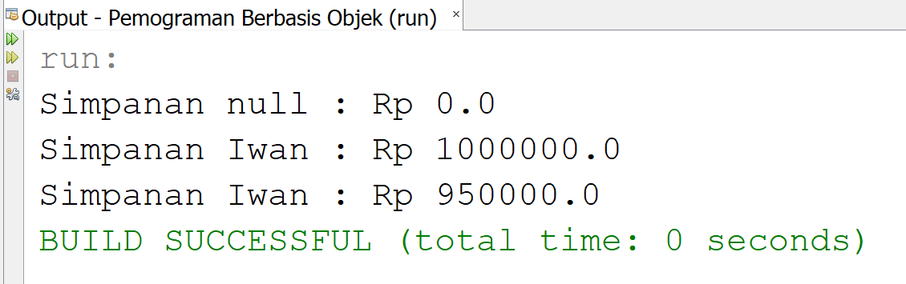

## Laporan Praktikum 3
# Hasil Output Percobaan

# Pertanyaan Percobaan 1 Dan 2

1. Karena Kondisi Mesin Belum On Maka Tidak Bisa Di Tambah Kecepatan
2. Untuk Proses Engkapsulasi Pada Suatu Program
3. 

# Pertanyaan Percobaan 3 Dan 4

1. Getter Untuk Mengisi Value Dari Suatu Variael Dan Setter Untuk Mengambil Data Dari Suatu Variabel Yang Telah Disi
2. Untuk Menyimpan Berapa Banyak Jumlah Simpanan Yang Dimiliki
3. Method setor()
4. Method Khusus Yang Akan Dijalankan Saat Instansiasi Objek
5. Nama Konstruktor Sama Dengan Nama Class
6. Tidak Boleh Karena Konstruktor Akan Diakses Di Class Main
7.
8.
9.

# Tugas

2. Karena Sudah DiProgram Jika Umur Lebih Dari 35 Maka Sama Dengan 30

3. 

5. 
