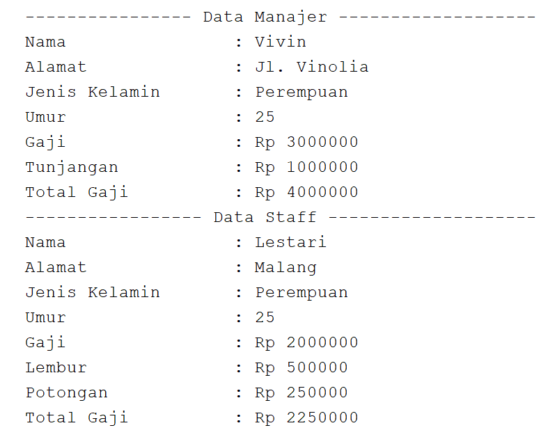
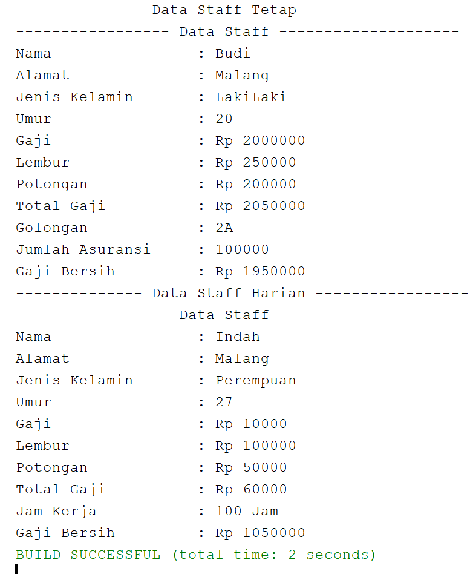
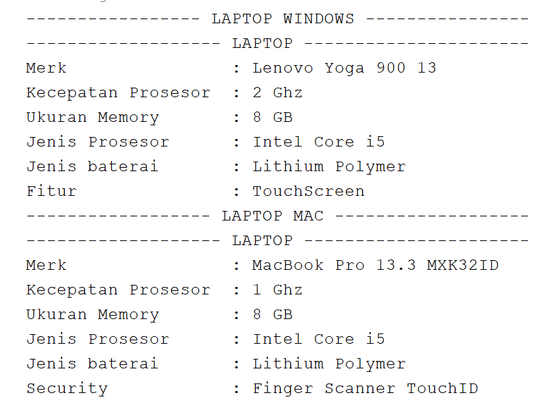
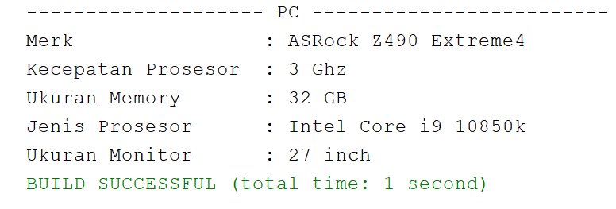

## Laporan Praktikum Pertemuan 7

# Output Percobaan 1

# Jawaban Pertanyaan

1. SuperClass : Karyawan
   SubClass   : Manajer, Staff
2. extends
3. Manajer : int tunjangan
   Inheritance Karyawan : String nama, String alamat, String jk, int umur, int gaji
4. Untuk Memanggil Atribut Dari ParentClass Atau SuperClass
5. Percobaan 1 Termasuk Hierarcial Inheritance Karena Memiliki Lebih Dari Satu Kelas Turunan / SubClass

# Output Percobaan 2

# Jawaban Pertanyaan

1. Single Inheritance Class : Manajer
   Multilevel Inheritance Class : Staff, StaffTetap, StaffHarian
2. StaffTetap     : String golongan, int asuransi
   StaffHarian    : int jamKerja
   Inheritance Staff : String nama, String alamat, String jk, int umur, int gaji, int lembur, int potongan
3. Untuk Membuat Konstruktor Turunan Dri Kelas Staff
4. Untuk Memanggil Method Turunan Dari Kelas Staff
5. Karena Atribut Tersebut Merupakan Atribut Bertype Public Turunan Dari Kelas Karyawan Dan Di Kelas StaffTetap Sudah Membuat Super Konstruktor

# Output Tugas

