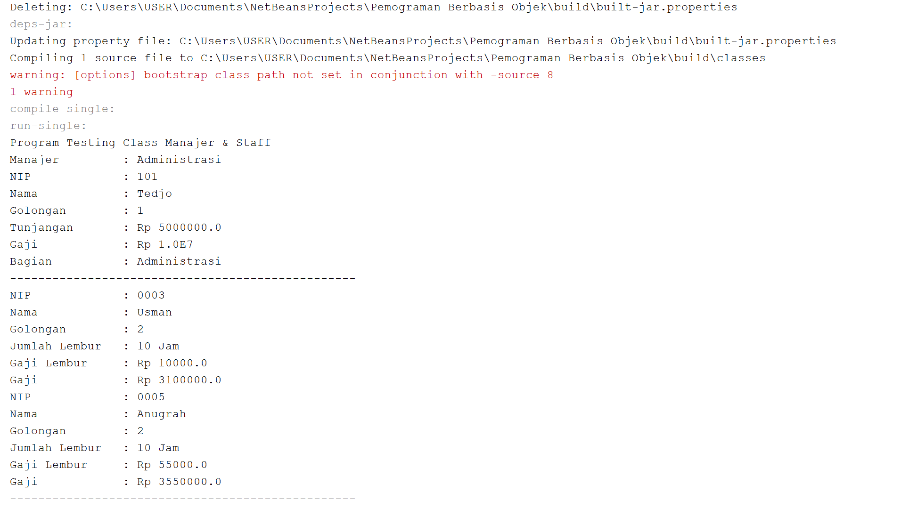
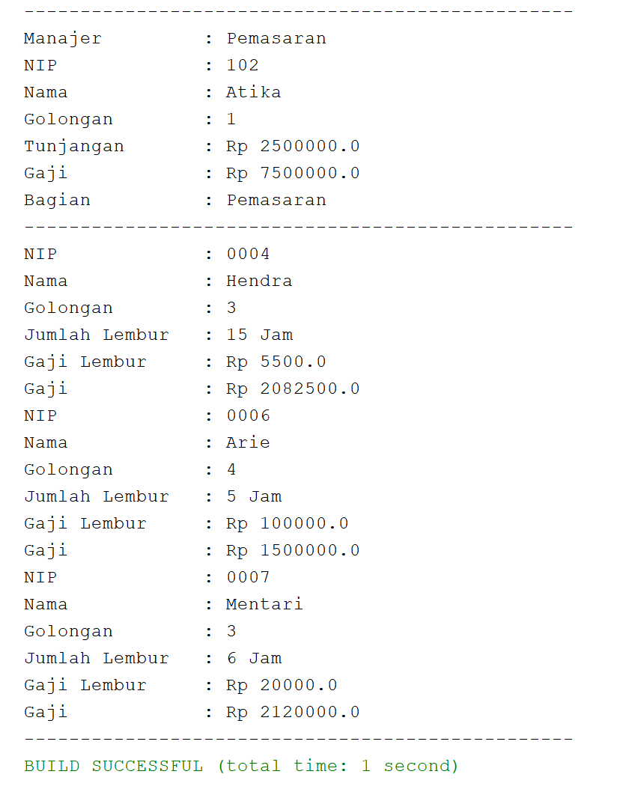
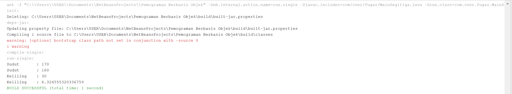

## Laporan Praktikum Pertemuan 9

# Output Percobaan 1

# Latihan

4.1 Pada Method Perkalian(int a, int b, int c)
4.2 Jumlah Parameter Yang Berbeda Ada 1 / (int c)

4.3 Pada Method Perkalian(double a, double b)
4.4 Jumlah Tipe Parameter Yang Berbeda Ada 2 / (double a, double b)

4.5 Pada Method Swim()
4.6 Method Swim() Class Piranha Merupakan Inheritance Dari Class Ikan Yang Mempunyai Method Swim()

# Tugas

